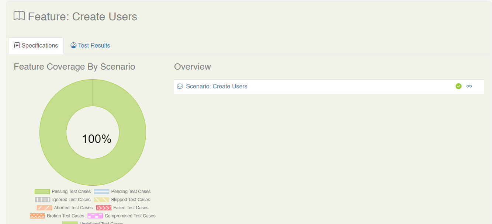
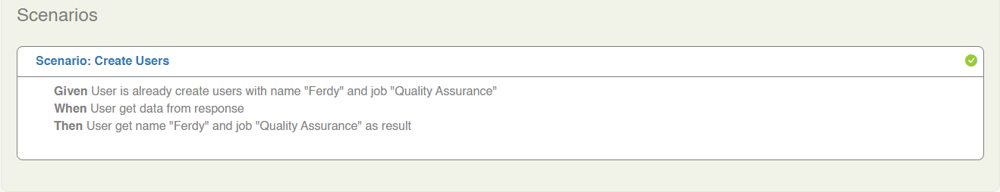
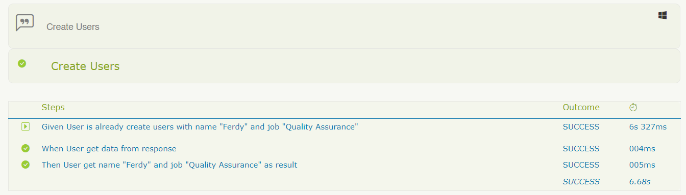
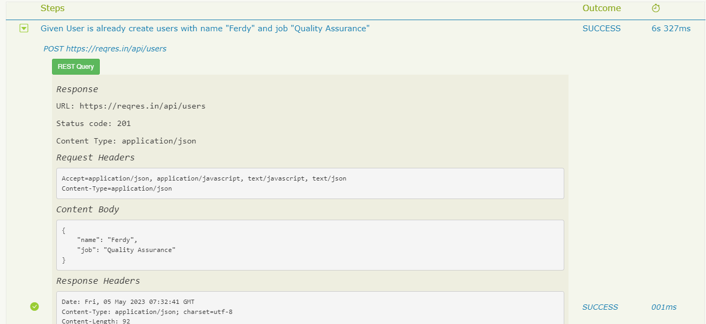

# serenity-starter-project-api

This Project API Automation Testing Using Rest Assured, Cucumber, JUnit and Serenity BDD for Reporting

## Required

1. Download [Java OpenJDK 11](https://jdk.java.net/java-se-ri/11)
   [Tutorial Installation Java in Windows](https://www.petanikode.com/java-windows/)

2. Download [Maven](https://maven.apache.org/download.cgi?Preferred=ftp://ftp.osuosl.org/pub/apache/)

`*If your computer already installed Java and Maven, you can skip step number 1 and 2.`

## Added New Scenario BDD

In order to added some Scenario BDD, we can create new file feature in directory `src/test/resources/features`

## Writing the step definitions (Breaking Down Scenario BDD Into Steps)

In order to translate the steps from Scenario BDD into executable actions, we write Java classes called Step Definitions
in directory `src/test/java/steps`

## API Key Configuration
This project uses an `x-api-key` header for API authentication. Ensure you include this header in each request.

## API Rate Limiting
There is a limit of 100 API requests per day per API key.
This limitation is due to the restrictions applied to the x-api-key header.

If the limit is exceeded, the server will respond with:
```
HTTP 429 - Too Many Requests
```

## API Key Location
The API key is stored in a `serenity config` file located at:
```
src/test/resources/serenity.conf
```
Example content:
```
environments {
    default {
         api.key = "your_api_key_here"
     }
    sit {
         api.key = "your_api_key_here"
    }
    prod {
         api.key = "your_api_key_here"
   }
}
```

## Running Test Case with Default Environment

```
mvn clean verify
```

## Running Test Case with Specific Environment (file `serenity.conf`)

file `serenity.conf` located in folder `src/test/resources`

```
mvn clean verify -Denvironment=value
```

## See Report Serenity BDD

- file report located in `target/site/serenity/index.html`



- Specific Test Details





